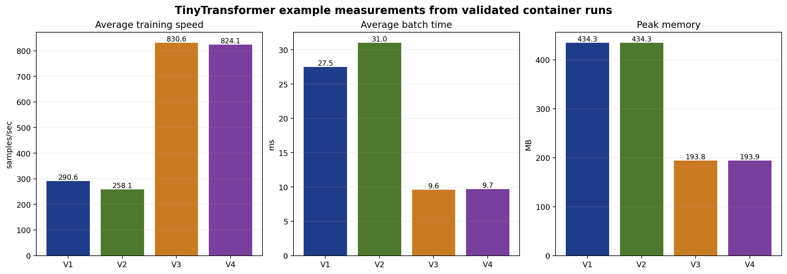

# ML Example: TinyTransformer Profiling Progression

This example keeps the same small decoder-only transformer and changes the implementation one step at a time. The point is not only to make the model faster. It is to see how the profiler output changes when the kernel mix, memory traffic, and framework path change.

[`version1_pytorch_baseline`](version1_pytorch_baseline) is the main hands-on tutorial. Versions 2 through 4 are comparison points built on the same workload.

## Version map

- [`version1_pytorch_baseline`](version1_pytorch_baseline): plain PyTorch reference implementation and the main tutorial entry point
- [`version2_pytorch_fused`](version2_pytorch_fused): framework-level fusion path; useful for checking whether the stack actually enables the intended fused kernels
- [`version3_triton`](version3_triton): custom Triton kernels for the main transformer building blocks
- [`version4_pytorch_sdpa`](version4_pytorch_sdpa): SDPA-based attention path with the later fused structure kept in place

## Recommended order

1. Start with [`version1_pytorch_baseline`](version1_pytorch_baseline) and record the baseline speed, batch time, memory use, hotspot list, and trace structure.
2. Move to [`version2_pytorch_fused`](version2_pytorch_fused) and check whether framework-level fusion changes the kernel mix on your software stack.
3. Use [`version3_triton`](version3_triton) to study the first large change in dispatch count and memory footprint.
4. Use [`version4_pytorch_sdpa`](version4_pytorch_sdpa) to compare a framework attention path against the custom Triton path in version 3.

## Example measurements

The table below shows one validated set of runs collected in the ROCm 6.4 training container on March 22, 2026. Treat these as example measurements, not as target numbers for every system.

| Version | Avg training speed | Avg batch time | Peak memory | Main observation |
|---------|--------------------|----------------|-------------|------------------|
| V1 baseline | 291.3 samples/sec | 27.5 ms | 434.3 MB | Reference PyTorch path |
| V2 fused | 259.0 samples/sec | 30.9 ms | 434.3 MB | Fused features were not active on this stack |
| V3 Triton | 829.9 samples/sec | 9.6 ms | 193.8 MB | Custom kernels changed both speed and memory use |
| V4 SDPA | 830.7 samples/sec | 9.6 ms | 193.9 MB | SDPA path landed close to V3 on this workload |

The stable point is the methodology: keep the model fixed, change one implementation layer at a time, and compare the traces, hotspot lists, and memory behavior.

The plot below was generated from the validated container runs with `generate_example_plots.py`.



## Common profiling tools

All version directories provide the same ROCm profiling workflow:

- `./get_hotspots.sh`: quick kernel ranking from `rocprofv3 --kernel-trace --stats`
- `./get_trace.sh`: runtime trace and Perfetto output
- `./get_counters.sh`: full kernel trace output
- `./get_rocprof_compute.sh`: hardware metrics when `rocprof-compute` is supported on the current GPU
- `./get_rocprof_sys.sh`: system trace; this script uses a smaller default step count to keep the run practical

The scripts also accept shared environment overrides through `profile_common.sh`. For example:

```bash
TINYTRANSFORMER_BATCH_SIZE=8 \
TINYTRANSFORMER_SEQ_LEN=128 \
TINYTRANSFORMER_NUM_STEPS=10 \
./get_trace.sh
```

## Additional material

- [`version1_pytorch_baseline/README.md`](version1_pytorch_baseline/README.md): primary tutorial for the progression
- [`generate_example_plots.py`](generate_example_plots.py): regenerates the example plots from validation logs
- [`VERSION_COMPARISON.md`](VERSION_COMPARISON.md): side-by-side comparison notes across versions
- [`TINY_LLAMA_ARCHITECTURE.md`](TINY_LLAMA_ARCHITECTURE.md): model structure and implementation notes
- [`TECHNICAL_APPENDICES.md`](TECHNICAL_APPENDICES.md): supplementary technical discussion
