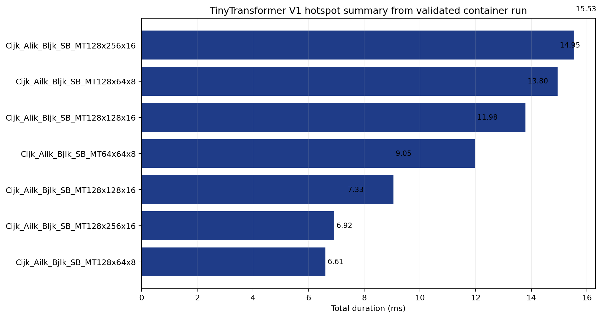

# TinyTransformer Version 1: PyTorch Baseline

This is the reference training path for the TinyTransformer progression. Start here, collect the baseline measurements, and then compare every later version against this directory.

## Environment

Load the required modules:

```bash
module load pytorch rocm
```

The profiling scripts use the same default workload:

- batch size `8`
- sequence length `128`
- training steps `10`

`get_rocprof_sys.sh` uses a smaller default step count so the system trace stays manageable. All scripts accept overrides through `TINYTRANSFORMER_BATCH_SIZE`, `TINYTRANSFORMER_SEQ_LEN`, `TINYTRANSFORMER_NUM_STEPS`, and `TINYTRANSFORMER_EXTRA_ARGS`.

## Baseline run

Run the model once before profiling:

```bash
python tiny_llama_v1.py --batch-size 8 --seq-len 128 --num-steps 10
```

Example output from one validated run:

```text
Performance Summary:
   Average training speed: 291.3 samples/sec
   Throughput: 37282 tokens/sec
   Average batch time: 27.5 ms
   Average forward time: 7.7 ms
   Average backward time: 14.8 ms
   Average optimizer time: 5.0 ms
   Peak memory usage: 434.3 MB
```

These are the reference numbers to compare with versions 2 through 4.

## Quick hotspot summary

Run:

```bash
./get_hotspots.sh
```

The script collects `rocprofv3 --kernel-trace --stats` and prints the top rows from the generated `*_kernel_stats.csv`. Example excerpt:

```text
"Name","Calls","TotalDurationNs","AverageNs","Percentage"
"Cijk_Alik_Bljk_SB_MT128x256x16_...",240,30763234,128180,8.79
"Cijk_Ailk_Bljk_SB_MT128x64x8_...",240,30083168,125347,8.59
"Cijk_Alik_Bljk_SB_MT128x128x16_...",360,26609605,73916,7.60
```

For this baseline, the first pass is simple: identify the dominant GEMM and elementwise kernels, then compare that list with later versions.

The figure below comes from the validated container run used for this tutorial:



## Runtime trace

Run:

```bash
./get_trace.sh
```

Example success output:

```text
Profiling complete! Results saved to: profiling_results/trace_<timestamp>
Perfetto trace file: .../28830_results.pftrace
Open it in Perfetto UI: https://ui.perfetto.dev/
```

The script now reports the largest generated Perfetto trace in the output tree, which avoids the small side traces that can also appear in the same run directory.

If your ROCm stack produces a database instead of a `.pftrace`, convert it with:

```bash
rocpd2pftrace -i <db_file> -o trace.pftrace
```

## Full kernel trace

Run:

```bash
./get_counters.sh
```

Example success output:

```text
Kernel trace CSV: .../29490_kernel_trace.csv
Agent info CSV: .../29490_agent_info.csv
```

On ROCm 7.x, the main output may be a database. Useful follow-up commands are:

```bash
rocpd2csv -i <db_file> -o kernel_stats.csv
rocpd summary -i <db_file> --region-categories KERNEL
```

The first quantities to record are total GPU time, dispatch count, unique kernel count, and the top kernels by total duration.

## Hardware metrics

Run:

```bash
./get_rocprof_compute.sh
```

On supported Instinct GPUs, the script collects `rocprof-compute` data and prints the follow-up analysis flow:

```bash
rocprof-compute analyze -p <raw_data_dir> --list-stats
rocprof-compute analyze -p <raw_data_dir> --dispatch <N>
rocprof-compute analyze -p <raw_data_dir> --dispatch <N> --block 2.1.15 6.2.7
rocprof-compute analyze -p <raw_data_dir> --dispatch <N> --block 16.1 17.1
```

On unsupported GPUs, the script exits cleanly. Example output:

```text
Skipping rocprof-compute profiling for TinyTransformer V1...
Detected GPU architecture: gfx1100
rocprof-compute hardware-counter collection currently requires a supported Instinct GPU
Use get_trace.sh, get_hotspots.sh, or get_counters.sh on this system instead.
```

## System trace

Run:

```bash
./get_rocprof_sys.sh
```

This script defaults to `2` training steps so the trace remains practical. Example success output:

```text
Profiling complete! Results saved to: profiling_results/rocprof_sys_<timestamp>
Perfetto trace file: .../perfetto-trace-31804.proto
Open it in Perfetto UI: https://ui.perfetto.dev/
```

On the validated ROCm 6.4 container, `rocprof-sys` also emitted `perf_event_paranoid` warnings and an `RSMI_STATUS_UNEXPECTED_DATA` backtrace before completing. Those messages were noisy, but the script still produced a usable Perfetto trace.

## Optional framework-level profiling

The Python driver also exposes framework-level instrumentation:

```bash
python tiny_llama_v1.py \
    --batch-size 8 \
    --seq-len 128 \
    --num-steps 20 \
    --enable-pytorch-profiler \
    --profile-dir ./pytorch_profiles \
    --profile-steps 5
```

Open the result with TensorBoard:

```bash
tensorboard --logdir ./pytorch_profiles --port 6006
```

## Workshop sequence

Use [`PYTORCH_BASELINE_WORKSHOP_WALKTHROUGH.md`](PYTORCH_BASELINE_WORKSHOP_WALKTHROUGH.md) for a shorter lab sequence built on the same commands.

## References

- rocprofv3: https://rocm.docs.amd.com/projects/rocprofiler-sdk/en/develop/how-to/using-rocprofv3.html
- rocpd tools: https://rocm.docs.amd.com/projects/rocprofiler-sdk/en/develop/how-to/using-rocpd-output-format.html
- Perfetto UI: https://ui.perfetto.dev/
