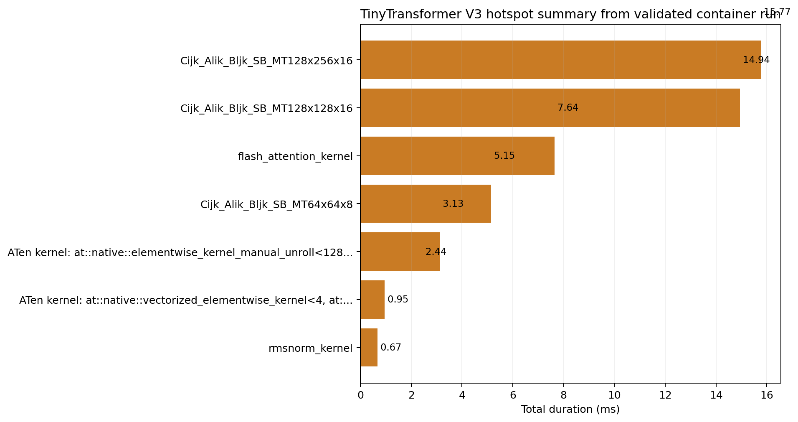

# TinyTransformer Version 3: Triton Kernels

Version 3 is where the progression changes materially. The custom Triton kernels reduce memory use, change the dominant kernel set, and move the training loop into a different performance regime.

## What changed

Relative to version 2, this version introduces:

- Triton RMSNorm kernels
- Triton attention kernels
- a Triton-backed SwiGLU path
- a smaller, more concentrated kernel mix

## Baseline run

Load the required modules:

```bash
module load pytorch rocm triton
```

Run:

```bash
python tiny_llama_v3.py --batch-size 8 --seq-len 128 --num-steps 10
```

Example output from one validated run:

```text
Performance Summary V3:
   Average training speed: 829.9 samples/sec
   Throughput: 106221 tokens/sec
   Average batch time: 9.6 ms
   Peak memory usage: 193.8 MB
```

That is the first large jump in the progression. The step time falls sharply and the memory footprint drops by more than half relative to the baseline.

## Profiling workflow

Use the same scripts as the earlier versions:

- `./get_hotspots.sh`
- `./get_trace.sh`
- `./get_counters.sh`
- `./get_rocprof_compute.sh`
- `./get_rocprof_sys.sh`

Start with `./get_hotspots.sh`. The first thing to check is whether the dominant kernel set is now smaller and heavier than in version 1. Then use `./get_trace.sh` and `./get_counters.sh` to confirm that the trace is less fragmented and the dispatch count is lower.

Example hotspot plot from the validated container run:



If `rocprof-compute` is supported on the current GPU, version 3 is also a good point to inspect block-level metrics because the set of important kernels is smaller than in the baseline.

## Workshop note

Use [`README_WORKSHOP.md`](README_WORKSHOP.md) for the short lab sequence. The staged debugging exercise under [`exercises/performance_debugging`](exercises/performance_debugging) is useful when the goal is to understand how the final optimized path was reached.

## References

- comparison across versions: [`../VERSION_COMPARISON.md`](../VERSION_COMPARISON.md)
- Triton tutorials: https://triton-lang.org/main/getting-started/tutorials/index.html
- Perfetto UI: https://ui.perfetto.dev/
