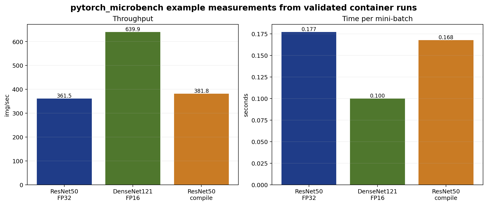
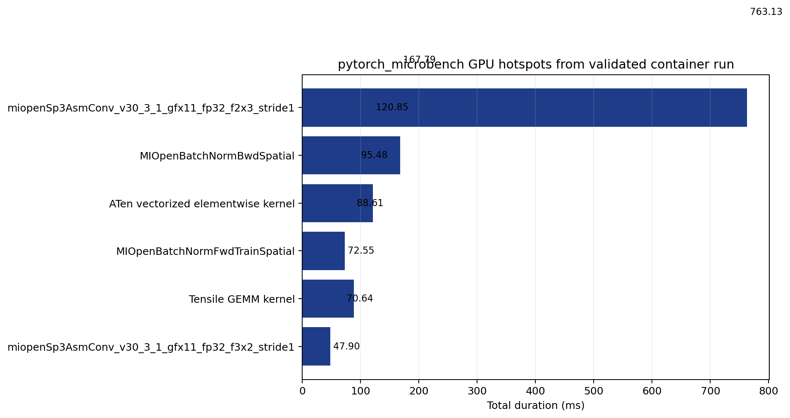

# PyTorch Micro-Benchmark Workshop Guide

The main walkthrough for this directory is the `README.md` file. This note keeps only a short set of exercises that can be completed in one sitting. The intent is to preserve a README-first workflow while still providing a compact lab sequence for training use.

## Preparation

Load the required modules:

```bash
module load pytorch rocm
```

Use the default case from the directory scripts unless there is a reason to change it:

```bash
python micro_benchmarking_pytorch.py --network resnet50 --batch-size 64 --iterations 10
```

Record the reported throughput before collecting any profiler output.

## Exercise 1: Baseline run

Run the benchmark once:

```bash
python micro_benchmarking_pytorch.py --network resnet50 --batch-size 64 --iterations 10
```

Write down the following quantities:

- throughput in images per second
- dtype
- batch size
- whether `--compile` or `--fp16 1` was used

This baseline gives the reference point for the remaining exercises.

The figure below was generated from fresh container runs with `generate_example_plots.py`. It shows the baseline case together with two follow-up variations used later in this workshop.



## Exercise 2: Runtime trace

Collect a full runtime trace:

```bash
./get_trace.sh
```

Open the generated `.pftrace` file in Perfetto:

```text
https://ui.perfetto.dev/
```

Inspect the trace with three questions in mind:

- Are the GPU kernels separated by visible idle gaps?
- Do memory operations appear in the critical path?
- Is the host side primarily launching work, or is it waiting on synchronization?

If time is limited, this is the first profiler we recommend running because it gives the clearest overall picture of the execution.

## Exercise 3: GPU hotspots

Collect a kernel trace:

```bash
./get_gpu_hotspots.sh
```

If the result is a ROCm 7.x database, extract a summary with:

```bash
rocpd2csv -i <db_file> -o kernel_stats.csv
rocpd summary -i <db_file> --region-categories KERNEL
```

From this output, record:

- total GPU time
- number of kernel dispatches
- number of unique kernels
- the top three kernels by time

For the CNN workloads in this directory, the dominant kernels are often convolution and batch normalization kernels from MIOpen. The exact names matter less than their share of the total time.

The plot below comes from an actual `get_gpu_hotspots.sh` run in the container and gives one compact example of the hotspot distribution.



## Exercise 4: Performance metrics

Collect a `rocprof-compute` report:

```bash
./get_performance_metrics.sh
```

Then list the detected kernels and dispatches:

```bash
rocprof-compute analyze -p <profile_dir> --list-stats
```

After selecting a dispatch, generate a focused report:

```bash
rocprof-compute analyze -p <profile_dir> --dispatch <N>
rocprof-compute analyze -p <profile_dir> --dispatch <N> --block 2.1.15 6.2.7
rocprof-compute analyze -p <profile_dir> --dispatch <N> --block 16.1 17.1
```

This exercise is most useful after Exercise 3 because it is easier to interpret the report when there is already a target kernel in mind. The occupancy-oriented block selection and memory-oriented block selection mirror the usage pattern in the `rocprof-compute` training examples elsewhere in this repository.

On systems where `rocprof-compute` hardware-counter collection is unavailable, treat this exercise as optional and continue with the remaining steps.

Questions to answer:

- Does the kernel appear limited by memory traffic or by arithmetic throughput?
- Is occupancy likely to be the issue?
- Does the report reinforce what was seen in the runtime trace?

## Exercise 5: System trace

Collect a system trace:

```bash
./get_rocprof_sys.sh
```

Open the resulting `.proto` file in Perfetto and compare it with the runtime trace from Exercise 2. The goal is not to replace the runtime trace, but to see whether the broader system view changes the interpretation of the run.

If the system-level view is not needed for the first pass, it is reasonable to stop after Exercise 4 and return to `rocprof-sys` later.

## Follow-up variations

After the default case has been studied, try one variable at a time:

```bash
python micro_benchmarking_pytorch.py --network densenet121 --batch-size 64 --iterations 10 --fp16 1
python micro_benchmarking_pytorch.py --network resnet50 --batch-size 64 --iterations 10 --compile
```

For each variation, compare:

- throughput
- dominant kernels
- trace shape
- whether the same profiler workflow still answers the main performance questions

## Closing remark

If only a short training exercise is desired, Exercises 1 through 3 are sufficient. They provide a complete path from benchmark run to trace to hotspot identification, which is usually enough to begin a more detailed performance study.
